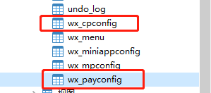
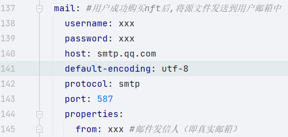
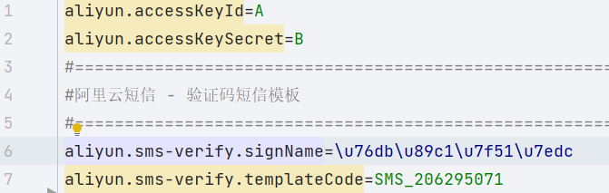

> 扫码关注公众号,体验nft
> 

# 克隆代码
```shell
git clone https://github.com/shengjian-tech/opennft.git
```
# 注册百度超级链开放网络
注册百度超级链开放网络账户https://xuper.baidu.com/  完成账户初始化, 下载个人私钥和address


# 合约安装
此步骤可省略,使用已安装完成的`opennft`合约即可

找到blockchainplatform-nft-web模块下的contractfile文件夹,合约安装按照百度超级链操作文档进行操作

go:https://xuper.baidu.com/n/doc#/e76de83b/1_0_0/64b3a685

java:https://xuper.baidu.com/n/doc#/e76de83b/1_0_0/e944842a

安装成功后将application.yml中的const.nftContractName的属性修改成对应的合约名,

# 导入数据库脚本
将blockchainplatform-nft-web模块sql目录下的.sql文件导入数据库

并完善`nft_chain_plat`,和`nft_user_chainplat`表中的信息
- passwd:安全码,使用SecUtils.encoderByRSAPrivateKey()加密后的数据
- address: 用户超级链的ak地址
- EVMAddress: 使用Account.xchainAKToEVMAddress(address)转换获取

最后将源文件放在resource的指定目录下


# 静态资源
将blockchainplatform-nft-web模块的的static.zip文件解压到与application.yml中staticdir属性值对应的目录下
# 微信配置
完善微信配置表中数据,用于微信登录和微信支付



# 邮箱配置
用于用户购买nft作品后将源文件,以邮件的方式发送到用户邮箱

在自己邮箱的设置中申请对应的信息填入application.yml中的mail对应的属性中


# 短信配置
用于用户完善个人信息时的手机号验证

申请使用阿里云短信服务,完善`application.properties`中的`aliyun.accessKeyId`和`aliyun.accessKeySecret`,以及申请成功的短信模板


# 前端项目
https://github.com/shengjian-tech/opennft-front

# 启动类
使用redis缓存,在application.yml中修改配置信息.

找到blockchainplatform-nft-web模块下的net.shengjian.makerone.SpringrainApplication启动类,进行启动

默认用户名/密码:`admin/123`
