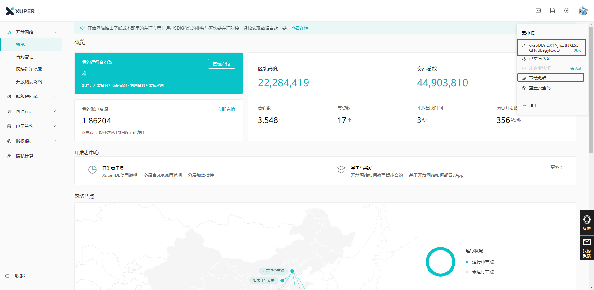
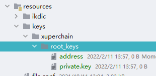

> 扫码关注公众号,体验nft
> 

# 克隆代码
```shell
git clone https://github.com/shengjian-tech/opennft.git
```
# 注册百度超级链开放网络
注册百度超级链开放网络账户https://xuper.baidu.com/  完成账户初始化, 下载个人私钥和address

# 导入数据库脚本
将blockchainplatform-nft-web模块sql目录下的.sql文件导入数据库

并完善`nft_chain_plat`,和`nft_user_chainplat`表中的信息
- passwd:安全码,使用SecUtils.encoderByRSAPrivateKey()加密后的数据
- address: 用户超级链的ak地址
- EVMAddress: 使用Account.xchainAKToEVMAddress(address)转换获取

最后将源文件放在resource的指定目录下


# 静态资源
将web模块的的static.zip文件解压到与application.yml中staticdir属性值对应的目录下
# 微信配置
完善微信配置表中数据,用于微信登录和微信支付


- 下载前端项目 https://github.com/shengjian-tech/opennft-front

使用redis缓存,在application.yml中修改配置信息

默认用户名/密码:`admin/123`